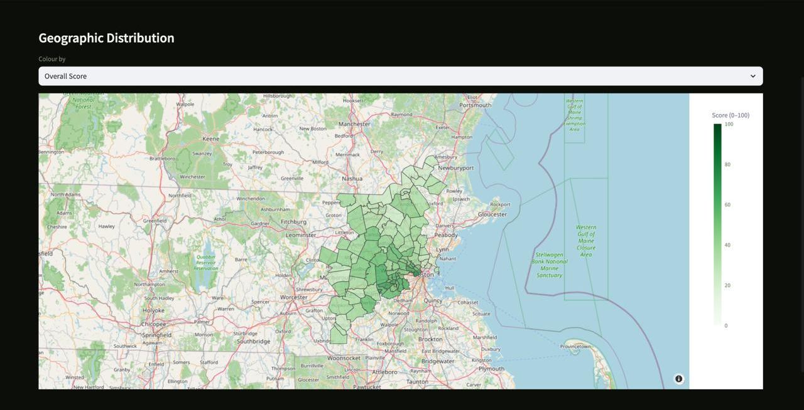
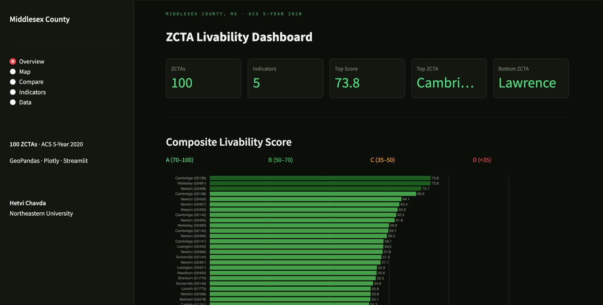
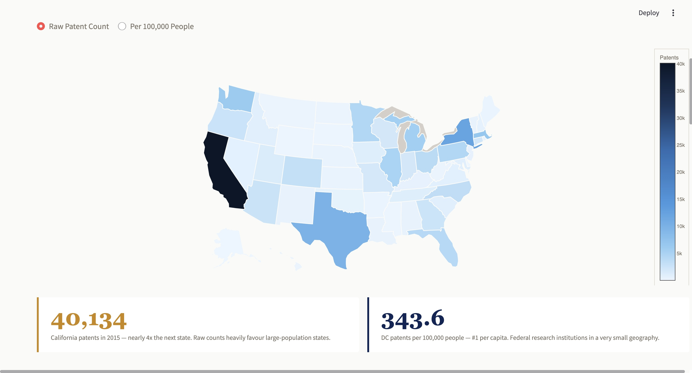
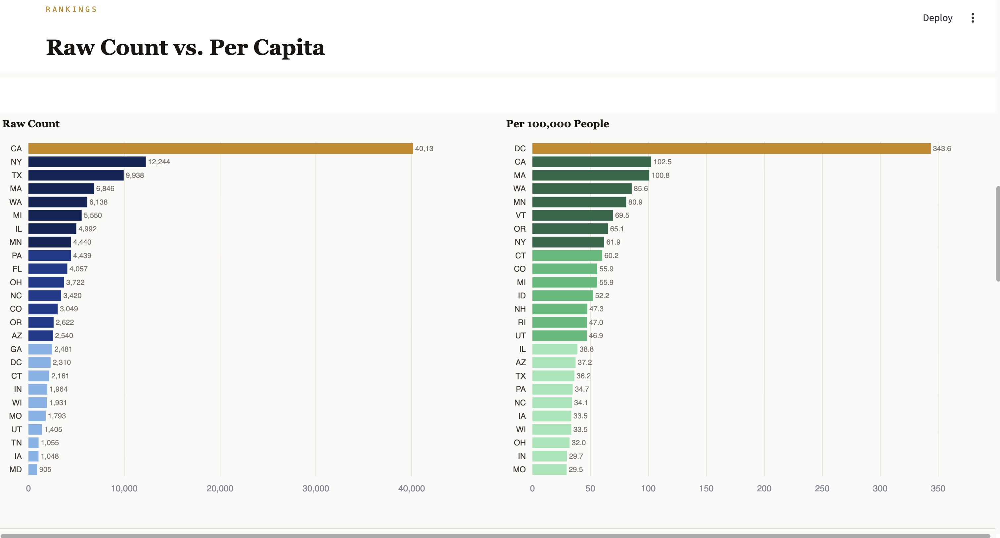

# Geospatial Analytics Portfolio
Hetvi Chavda — MS Data Analytics Engineering, Northeastern University

A collection of interactive geospatial analytics dashboards that transform public data into insights about how people live, work, and innovate across regions.

This repository showcases end-to-end data projects that combine public datasets, spatial joins, geographic boundaries, and interactive dashboards to turn raw location-based data into clear analytical insights.


---

## Projects

### 1. Middlesex County ZCTA Livability Dashboard

An interactive dashboard analyzing ZIP Code Tabulation Areas (ZCTAs) in and around Middlesex County, Massachusetts through a composite livability index.

The index combines five indicators:
- Median household income
- Educational attainment
- Median home value
- Mean commute time
- Population density

Each ZCTA receives a normalized 0–100 score and a letter grade, enabling comparisons across multiple quality-of-life dimensions.

This project combines geospatial processing, feature normalization, and interactive visualization to explore regional differences in livability.





**Key Findings**
- Cambridge (02139) and Wellesley (02481) tied #1 at 73.8 — Cambridge leads on education (76.6% Bach+), Wellesley on income ($227,898)
- Lawrence (01840) ranks last at 10.2 — lowest income in the county, highest population density
- Wealthy outer suburbs score lowest on commute despite high incomes
- Two ZCTAs with Census suppression codes (−666666666) filled with county medians rather than dropped, preserving all 100 ZCTAs

**Tech Stack:** Python · GeoPandas · Plotly · Streamlit  
**Data Source:** ACS 5-Year 2020 (Census API) · TIGER/Line ZCTA boundaries

```bash
cd middlesex_livability
streamlit run Middlesex_app.py
```
The dashboard allows users to explore spatial patterns and compare livability scores interactively across the county.

---

### 2. USPTO Patent Choropleth Map

Maps utility patent grant activity across all 50 U.S. states and DC using USPTO CBSA data for 2015, with two choropleth views — raw count and per-capita rate.

This project highlights how geographic patterns of innovation shift when comparing absolute counts versus population-adjusted metrics.






**Key Findings**
- California leads raw volume at 40,134 patents — nearly 4× New York (12,244)
- DC leads per capita at 343.6 per 100K — federal research institutions in a tiny geography
- Massachusetts ranks top-3 per capita at 100.8, driven by the Boston-Cambridge biotech corridor
- San Jose metro alone produced 14,618 patents — more than most entire states

**Tech Stack:** Python · GeoPandas · Plotly · Streamlit  
**Data Sources:** USPTO Utility Patent Grants 2015 · TIGER/Line state boundaries · Census 2015 population estimates

```bash
cd uspto_patent_map
streamlit run uspto_app.py
```

---

## Clone & Setup

```bash
git clone https://github.com/HAC-11/Portfolio-Demos-.git
cd Portfolio-Demos-
pip install -r requirements.txt
```

Census API key (free): https://api.census.gov/data/key_signup.html

Shapefiles not included due to size:
- ZCTA: https://www2.census.gov/geo/tiger/GENZ2020/shp/cb_2020_us_zcta520_500k.zip
- States: https://www2.census.gov/geo/tiger/TIGER2020/STATE/tl_2020_us_state.zip
